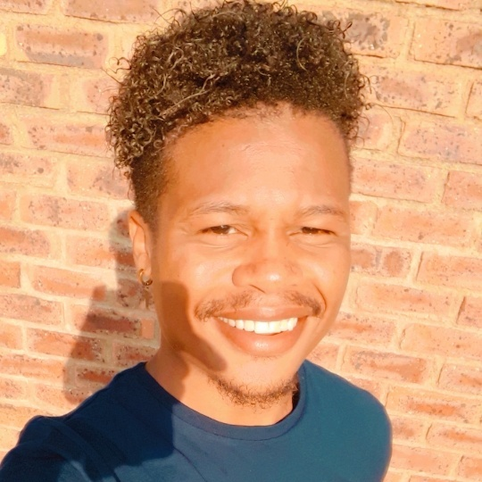

### Hi there 👋, I'm 
# <h1 align="center">Simo Nkosi</h1>

  

&nbsp;
## Welcome to my profile

:computer: A multi-skilled **Full-Stack Developer** with hands-on experience in developing, and scripting powerful set of web technology tools and design. I have extensive soft skills like time management, handling expectations, direct client based customer service, working under pressure to meet deadlines, great communication skills with fluency in English, acquiring new technical skills in short period of time, and remote collaboration through pair programming.

:mortar_board: I am currently enrolled at , an online school for **remote software developers**.
&nbsp;

## 
My Professional Stats

 &nbsp; &nbsp; &nbsp;

## Core technologies
&nbsp;

 &nbsp;
 &nbsp;
 &nbsp;
 &nbsp;
 &nbsp;
 &nbsp;
 &nbsp;
 &nbsp;
 &nbsp;

&nbsp;

- 🔭 I’m interested in AI, machine learning and contributing to open source. I love innovation an I hope to invent something that will revolutionize the world on the level of Elon Mask's Tesla and SpaceX.
- 🌱 I love a challenge and growth. I'm an INTJ; which means that i'm very logically minded, intuitive, analytical and with excellent problem solving skills. I am very principled when it comes to morality and ethics.
- 👯 Through Microverse, I'v learned to love collaboration; which we practiced through remote pair programming. I found working in teams and solving challenges in groups to be very productive and insightful.

## About myself

  Apart from my passion for web development:
  - I love movies :movie_camera:. Specifically the marvel cinematic universe. To take my mind off things I usually watch YouTube movie reviews, reactions, comics talk, upcoming movies and I'ld like to think I'm a movie critic myself.:smirk:
  - I spend some of my time building worlds in my mind, generating ideas and occasionally debating with myself about current issues :laughing:... what?... My mind works like a giant computer I can't help it :see_no_evil:
  - My friends say I'm very intellectual, a perfectionist and a over achiever.
  - I'ld love to travel and explore the world in the near future. Especially attending tech events and innovative exhibitions all around the world.
  - I play tennis :tennis:, and I love extreme sports like snowboarding :snowboarder:, skiing :ski:, surfing :surfer:, cycling :bicyclist:, sky diving, bungee jumping, and hiking. I'm also a big fan of the Olympics, especially athletics.

## Find me on:

<a target="_blank"
href="https://www.linkedin.com/in/simo-nkosi-418523180/"></img></a> &nbsp;
<a target="_blank"
href="https://twitter.com/RealSimoNkosi"></img></a>  &nbsp;
<a target="_blank"
href="mailto:simosakhenkosi@gmail.com"></img></a> &nbsp;

